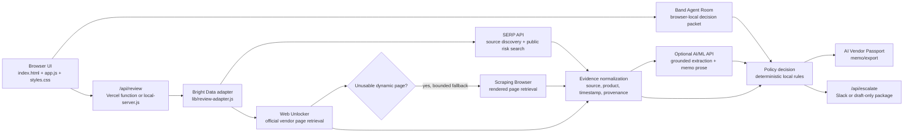

# ClearGate AI

**ClearGate AI — Band-powered Shadow AI approval for enterprise security and procurement teams.**

ClearGate AI turns unapproved AI tools into audit-ready approval decisions using Band-powered agents for security, legal, finance, procurement, and compliance. It keeps the existing evidence ledger, deterministic policy gate, human override, and exportable AI Vendor Passport workflow intact.

Live app: [https://cleargate-ai.vercel.app/](https://cleargate-ai.vercel.app/)
Repository: [https://github.com/anilandcode/cleargate-ai](https://github.com/anilandcode/cleargate-ai)

## Problem

Employees often adopt AI tools before governance teams can approve them. Security, privacy, procurement, and GRC teams then need fast answers to practical questions:

- Which unapproved tools are already in use?
- Which tools touch source code, call recordings, customer notes, contracts, or internal documents?
- What public evidence supports an approve, conditional approve, escalate, or block decision?
- Has the vendor documentation or public risk profile changed since the last review?

Manual vendor review is slow because trust centers, privacy policies, subprocessor pages, docs, and public risk signals are scattered across the web and change over time.

## Solution

ClearGate AI turns Shadow AI intake into an evidence-backed approval workflow:

**Shadow AI Inbox -> Band Agent Room -> Live Public Evidence -> Policy Gate -> Decision -> AI Vendor Passport Memo -> Continuous Re-review**

The current app opens with a deterministic seeded judge workspace containing 11 AI tools, varied risk levels, and varied decisions. Reviewers can import additional tools, run queue review, run a Band agent review, run live verification for a vendor, inspect evidence rows, override decisions, save reviewer notes, and export approval memos.

Continuous re-review is implemented as repeatable reviewer-triggered verification through the queue and vendor review flows. There is no background scheduler or database persistence in this build.

## Band Agent Room

The Agent Room tab coordinates six deterministic demo agents over the selected vendor:

- Discovery Agent
- Security Agent
- Privacy & Legal Agent
- Finance & Procurement Agent
- Compliance Agent
- Policy Gate Agent

Running the Band review creates a collaboration timeline, shared context packet, recommendation, audit hash, and memo-ready `Band Agent Finding` evidence records. Human reviewers can explicitly approve with conditions, escalate, or block from the room; those actions are saved into reviewer notes and included in memo/export payloads.

## Bright Data Integration

Implemented server-side live review capabilities:

- **SERP API**: discovers official vendor sources and searches public risk signals.
- **Web Unlocker**: retrieves official vendor pages such as privacy, trust, subprocessor, and documentation pages.
- **Scraping Browser / Browser API**: selectively escalates a public official page when Web Unlocker fails, returns an application shell, or returns unusable content. It uses Bright Data Browser API zone username/password through the documented CDP WebSocket endpoint and is capped at one fallback attempt per vendor review by default.
- **Server-side adapter**: `/api/review` calls `lib/review-adapter.js`, keeps credentials out of browser code, normalizes evidence records, and returns the same response shape in live and seeded fallback modes.
- **Seeded/cached replay**: keeps the judge demo reliable. Seeded rows are explicitly labeled `SEEDED DEMO DATA`; cached live rows are labeled `CACHED LIVE SNAPSHOT`; real successful server-side Bright Data calls are labeled `LIVE FETCH`.

Browser API is disabled unless its dedicated server-side zone credentials are configured. It is never invoked during page load or seeded workspace reset. See Bright Data's official [Browser API configuration documentation](https://docs.brightdata.com/scraping-automation/scraping-browser/configuration).

## Optional AI/ML API Intelligence

When `AIMLAPI_ENABLED=1`, the server sends bounded retrieved public evidence text to the AI/ML API chat-completions endpoint. The model may extract a structured cited finding and draft concise memo language. It is grounded and non-authoritative:

- it receives only the vendor name, official source URL, source type, bounded retrieved text, and relevant policy questions;
- supporting quotes must exist verbatim in the retrieved text or the server rejects the finding;
- unsupported claims fall back to rules-based signals;
- the model never calculates or overrides `Approve`, `Approve with conditions`, `Escalate`, or `Block pending review`.

See the official [AI/ML API setup documentation](https://docs.aimlapi.com/quickstart/setting-up).

## Workflow Escalation

`POST /api/escalate` can send a concise escalation package to Slack when `SLACK_WEBHOOK_URL` is configured. The existing button remains usable without a webhook: it generates a downloadable draft-only package. Delivery failures preserve the draft and show a retry action.

## Demo Workflow

Five-minute judge walkthrough:

1. Load the app and show the seeded Shadow AI Inbox with 11 tools and mixed decisions.
2. Open **Otter.ai** to show a high-risk meeting AI tool blocked pending legal/privacy review.
3. Click **Run live verification** on the vendor review page.
4. Review the Evidence Ledger, provenance labels, cited source URLs, policy findings, and deterministic decision.
5. Open the Memo tab and export the AI Vendor Passport memo for audit or procurement handoff.

## Architecture



The browser stores the current workspace in `localStorage`. The live review adapter runs server-side only, so Bright Data credentials are never exposed to browser JavaScript.

## Evidence And Audit Model

Each evidence record is normalized for review and memo inclusion. Implemented fields include:

- source URL
- fetched timestamp or seeded timestamp
- retrieval product path, such as `SERP API` or `Web Unlocker`
- selective retrieval product `Scraping Browser` only when an actual managed-browser fallback succeeds
- provenance label: `LIVE FETCH`, `CACHED LIVE SNAPSHOT`, `SEEDED DEMO DATA`, or `PLANNED QUERY`
- evidence status, such as fresh, seeded, stale, needs review, or missing
- extracted claim or finding
- confidence score
- mapped policy clause
- pipeline stage: source discovery, page fetch, claim extraction, policy mapping, or memo inclusion
- decision outcome: `Approve`, `Approve with conditions`, `Escalate`, or `Block pending review`

The app emits readable `EV-*` evidence IDs plus full SHA-256 hashes calculated from normalized retrieved page content. The detail drawer and exported memo expose the full snapshot hash. Discovery activity is kept separate from memo evidence.

## Local Setup

No dependency installation is required.

Open as a static app:

```bash
python3 -m http.server 3000
```

Then visit:

```txt
http://localhost:3000
```

Run with the local API adapter:

```bash
node local-server.js
```

Build the static Vercel frontend output:

```bash
npm run build
```

The build writes `dist/index.html`, `dist/app.js`, `dist/styles.css`, and `dist/assets/`. Vercel serves that static output while keeping `api/` as file-based serverless functions. `local-server.js` is only for local development.

Available local endpoints:

```txt
GET  http://localhost:3000/healthz
GET  http://localhost:3000/api/healthz
POST http://localhost:3000/api/review
POST http://localhost:3000/api/escalate
```

Run the full validation suite:

```bash
node scripts/validate-all.js
```

## Environment Variables

Use `.env.example` as the safe placeholder template. Live Bright Data mode is opt-in:

```txt
BRIGHTDATA_LIVE=1
BRIGHTDATA_API_TOKEN=your_bright_data_api_token
BRIGHTDATA_SERP_ZONE=your_serp_zone
BRIGHTDATA_UNLOCKER_ZONE=your_unlocker_zone
BRIGHTDATA_COUNTRY=us
BRIGHTDATA_TIMEOUT_MS=12000
BRIGHTDATA_BROWSER_ENABLED=0
BRIGHTDATA_BROWSER_USERNAME=your_browser_api_zone_username
BRIGHTDATA_BROWSER_PASSWORD=your_browser_api_zone_password
BRIGHTDATA_BROWSER_MAX_PER_REVIEW=1
AIMLAPI_ENABLED=0
AIMLAPI_API_KEY=your_aimlapi_key
AIMLAPI_MODEL=your_aimlapi_model
AIMLAPI_BASE_URL=https://api.aimlapi.com/v1
SLACK_WEBHOOK_URL=https://hooks.slack.com/services/your/webhook/path
PORT=3000
```

Without Bright Data credentials, the app remains fully usable through the seeded judge workspace and server fallback evidence shape.

`BRIGHTDATA_BROWSER_USERNAME` and `BRIGHTDATA_BROWSER_PASSWORD` come from the Browser API zone Overview screen. The zone is encoded in the provided username. Keep `BRIGHTDATA_BROWSER_ENABLED=0` until those dedicated credentials are available.

## Public-Data And Human-Review Guardrails

- ClearGate AI retrieves public web evidence only.
- Do not configure it to collect authenticated, behind-login, paywalled, private, or employee-specific data.
- Bright Data credentials are used only in server-side API code.
- Seeded demo evidence is clearly labeled and should not be presented as live evidence.
- Final approvals remain human-reviewable through decision overrides, reviewer notes, and memo export.
- Policy decisions are deterministic and explainable; an LLM is not used to decide approve/escalate/block outcomes.

## Product Claims Audit

| Capability | Status | Notes |
| --- | --- | --- |
| Seeded Shadow AI inbox | Implemented | Deterministic 11-tool judge workspace. |
| Band Agent Room | Implemented | Six browser-local demo agents produce handoffs, findings, recommendation, audit hash, and human actions. |
| Policy Gate decisions | Implemented | Deterministic explainable rules with human override. |
| AI Vendor Passport memo export | Implemented | Includes cited final evidence and SHA-256 hashes. |
| SERP API canonical source discovery | Implemented | Runs server-side in live mode. |
| Web Unlocker retrieval | Implemented | Default official-page retrieval path. |
| Scraping Browser fallback | Implemented, credential verification pending | Bounded dynamic-page escalation, disabled by default. |
| Evidence provenance and SHA-256 snapshots | Implemented | Live, cached, and seeded origins remain distinct. |
| Reviewer-triggered evidence drift comparison | Implemented | Compares prior live hashes during a new live review; no scheduler. |
| AI/ML API grounded extraction | Implemented, credential verification pending | Optional and non-authoritative; rules fallback remains active. |
| Slack escalation | Implemented, webhook verification pending | Sends when configured; downloadable draft otherwise. |
| Static Vercel frontend build | Implemented | `npm run build` writes `dist/`; `api/` remains file-based serverless functions. |
| Background monitoring | Planned | No scheduler or database-backed worker. |
| Database audit history | Planned | Current workspace persists in browser `localStorage`. |

## Hackathon Submission

- **Primary track:** Security & Compliance
- **Product thesis:** Enterprise AI adoption is moving faster than governance review. ClearGate AI gives security and procurement teams an evidence-backed approval gate that can convert scattered public vendor data into auditable AI tool decisions.
- **Live app:** [https://cleargate-ai.vercel.app/](https://cleargate-ai.vercel.app/)
- **Repository:** [https://github.com/anilandcode/cleargate-ai](https://github.com/anilandcode/cleargate-ai)

## Roadmap-Labeled Items

These are intentionally not claimed as active production features:

- Database-backed audit history.
- Scheduled background monitoring.
- Production authentication, tenancy, and role-based access control.
