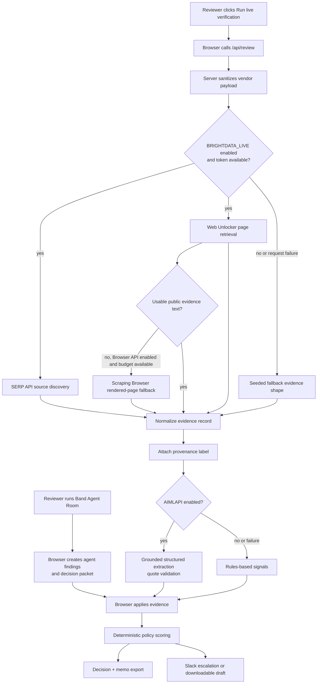

# ClearGate AI Architecture

ClearGate AI is a dependency-light vanilla HTML/CSS/JS app with a browser-local Band Agent Room and optional server-side Bright Data verification.

## Runtime Components

- `index.html`: application shell, navigation, import drawer, review tabs, detail drawer.
- `styles.css`: enterprise SaaS visual system and responsive layout.
- `app.js`: seeded workspace, local state, intake parsing, Band agent room, policy rules, evidence rendering, memo export, and browser-side workflow orchestration.
- `server.js`: dependency-free local HTTP server for static files and API routes. It is for local development only.
- `api/review.js`: Vercel-compatible review API route.
- `api/escalate.js`: Vercel-compatible escalation package route.
- `lib/review-adapter.js`: server-side Bright Data adapter and evidence normalization.
- `lib/aiml-adapter.js`: optional grounded AI/ML API extraction and non-authoritative memo drafting.
- `lib/workflow-adapter.js`: optional escalation package delivery/draft generation.
- `scripts/build-static.js`: copies the static frontend into `dist/` for Vercel.
- `scripts/validate-all.js`: one-command syntax, contract, adapter, secret-scan, and server validation.

## Band Agent Room

The Agent Room tab is browser-local and deterministic for the demo path. It coordinates Discovery, Security, Privacy & Legal, Finance & Procurement, Compliance, and Policy Gate agents over the selected vendor packet. Running the room creates:

- shared review context;
- agent findings;
- handoff timeline;
- approval recommendation;
- audit hash;
- memo-ready `Band Agent Finding` evidence records;
- explicit human actions for approve with conditions, escalate, or block.

The Band layer does not require paid API keys in this build and does not silently override the reviewer. Human actions are saved as reviewer notes and included in exports.

## Live Evidence Pipeline

## Bright Data Use

Implemented:

- SERP API for source discovery and public risk search.
- Web Unlocker for public vendor page retrieval.
- Selective Scraping Browser fallback for a Web Unlocker failure, application shell, 404, minimal text response, or unusable JS-heavy page. The default cap is one Browser API attempt per vendor review.
- Server-side cache reuse for repeated live reviews within the configured TTL.
- Fallback evidence shape for demo reliability.

Scraping Browser is disabled until `BRIGHTDATA_BROWSER_ENABLED=1` and the dedicated Browser API zone username/password are configured. The implementation uses Bright Data's documented CDP WebSocket endpoint and does not run during seeded reset or page load.

## AI/ML API Use

`lib/aiml-adapter.js` optionally calls `POST /chat/completions` on the configured AI/ML API base URL. Its role is limited to grounded extraction and memo prose:

- only bounded retrieved public text is sent;
- returned supporting quotes must occur verbatim in supplied evidence;
- invalid, unsupported, or failed responses fall back to rules-based signals;
- AI output never selects or overrides the deterministic policy decision.

## Evidence Normalization

Evidence records use a common shape across live, cached, seeded, and planned records:

- `url`
- `officialSourceUrl`
- `title`
- `sourceTitle`
- `sourceType`
- `product`
- `discoveryProduct`
- `retrievalProduct`
- `discoveryQuery`
- `retrievalStatus`
- `sourceDomain`
- `fetchedAt`
- `claim`
- `readablePreview`
- `extractedSignals`
- `confidence`
- `clause`
- `status`
- `pipelineStage`
- `includedInMemo`
- `evidenceHash`
- `evidenceId`
- `snapshotSha256`
- `snapshotPreviewSha256`
- `fallbackReason`
- `extractionMethod`
- `aiExtraction`
- `provenance`
- `evidenceOrigin`

Provenance labels are intentionally visible in the UI:

- `LIVE FETCH`: real server-side Bright Data request succeeded.
- `CACHED LIVE SNAPSHOT`: server reused a recent live result for speed and cost control.
- `SEEDED DEMO DATA`: deterministic judge/demo evidence.
- `PLANNED QUERY`: prepared discovery query not yet fetched.

The compact `evidenceId` is a readable UI identifier. `snapshotSha256` is calculated from normalized retrieved content, and `snapshotPreviewSha256` verifies the displayed excerpt separately.

## Policy Pipeline

The policy gate is deterministic:

1. Required evidence types are selected from the vendor policy profile.
2. Missing evidence is calculated from attached source types.
3. Risk score and gap index are recalculated after review runs.
4. `decisionFromVendor()` returns one of:
   - `Approve`
   - `Approve with conditions`
   - `Escalate`
   - `Block pending review`
5. Reviewers can override the decision and add notes.
6. The memo export includes decision, risks, missing evidence, policy findings, reviewer notes, evidence hashes, and evidence records.

Reviewer-triggered live re-verification compares prior live snapshot hashes with newly fetched hashes. Detected changes are logged as evidence drift. There is no background scheduler.

No LLM decides the final outcome in the current implementation.

## Persistence And Deployment

- Browser workspace state persists in `localStorage`.
- Live review credentials are read only from server-side environment variables.
- Slack webhook and AI/ML API credentials are read only from server-side environment variables.
- Vercel runs `npm run build`, serves static assets from `dist/`, and keeps `api/` routes as file-based serverless functions.
- `server.js` is not the deployed app server on Vercel.
- Without Bright Data credentials, the seeded judge workspace remains usable and clearly labeled.

## Guardrails

- Retrieve public web evidence only.
- Do not collect authenticated, behind-login, paywalled, or private data.
- Do not put API tokens in browser code.
- Do not label seeded or fallback records as live evidence.
- Keep final approvals human-reviewable.
